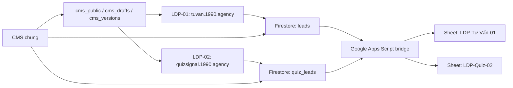

# 1990 LDP Platform

Repository nội bộ quản lý hệ thống landing page của 1990 Agency, gồm **hai LDP độc lập**, một CMS dùng chung, Firebase/Firestore và cầu nối Google Sheets.

> Repository này phải được giữ ở chế độ **Private**. Không đưa API key bí mật, access token, service-account key hoặc dữ liệu lead thật vào Git.

## Trạng thái production

| Mã | Sản phẩm | Source production | Hosting site | Domain | Firestore | Google Sheet |
|---|---|---|---|---|---|---|
| `LDP-01` | Tư vấn miễn phí | `1990-ldp-tu-van-mien-phi/` | `ldp-tu-van-mien-phi` | [tuvan.1990.agency](https://tuvan.1990.agency) | `leads` | `LDP-Tư Vấn-01` |
| `LDP-02` | Quiz Signal System | `2 - LDP Quiz 2/LDP 1990 Quiz/` | `1990-ldp-quiz-signal` | [quizsignal.1990.agency](https://quizsignal.1990.agency) | `quiz_leads` | `LDP-Quiz-02` |

Hai LDP không phải phiên bản 1/2 của cùng một trang. Chúng là hai sản phẩm riêng, có form, collection lead, Hosting site và domain riêng.

## Thành phần dùng chung

| Thành phần | Thư mục | Vai trò |
|---|---|---|
| CMS nội bộ | `1990-ldp-cms/` | Quản lý nội dung, cấu hình tích hợp, lead, phiên bản và quyền truy cập của cả hai LDP |
| Google Sheets bridge | `google-apps-script/` | Nhận lead và phân phối sang đúng tab Google Sheet |
| Firestore Rules | `1990-ldp-tu-van-mien-phi/firestore.rules` | Bảo vệ cấu hình CMS và hai collection lead |
| Tài liệu vận hành | `docs/` và các file hướng dẫn ở root | Kiến trúc, deploy, kiểm thử, bảo mật và lịch sử phiên bản |

CMS dùng chung không làm hai LDP trộn dữ liệu. Mỗi page ID được ánh xạ tới collection và cấu hình riêng:

```text
CMS chung
├── ldp01 → LDP Tư vấn miễn phí → leads → LDP-Tư Vấn-01
└── ldp02 → LDP Quiz Signal     → quiz_leads → LDP-Quiz-02
```

## Luồng dữ liệu lead



Lead có thể chứa thông tin form, URL trang, referrer, UTM và click ID như `gclid`, `fbclid`, `fbc`, `fbp`, `ttclid`. Firestore là nguồn dữ liệu chính; Google Sheet là bản đồng bộ phục vụ vận hành.

## Cấu trúc source

### LDP-01 — Tư vấn miễn phí

```text
1990-ldp-tu-van-mien-phi/
├── index.html
├── assets/
├── js/
│   ├── attribution.js
│   ├── cms-loader.js
│   ├── firebase-init.js
│   ├── lead-submit.js
│   └── tracking.js
├── docs/
├── firebase.json
├── firestore.rules
└── package.json
```

### LDP-02 — Quiz Signal System

```text
2 - LDP Quiz 2/LDP 1990 Quiz/
├── index.html
├── assets/
├── js/
│   ├── attribution.js
│   ├── cms-loader.js
│   ├── firebase-init.js
│   ├── quiz-lead-submit.js
│   └── tracking.js
└── firebase.json
```

### CMS

```text
1990-ldp-cms/
├── index.html
├── styles.css
├── js/
│   ├── app.js
│   └── config.js
├── firebase.json
└── README.md
```

## Yêu cầu môi trường

- Node.js 20 trở lên.
- Firebase project: `ldp-tu-van-mien-phi`.
- Firebase CLI được cài từ `1990-ldp-tu-van-mien-phi/package.json`.
- Tài khoản Firebase có quyền deploy Hosting và Firestore Rules.
- Tài khoản GitHub có quyền với repository private này.

Thiết lập dependency:

```powershell
Set-Location -LiteralPath '.\1990-ldp-tu-van-mien-phi'
npm.cmd install
```

Đăng nhập Firebase:

```powershell
.\node_modules\.bin\firebase.cmd login --reauth
```

## Deploy

Không deploy bằng câu lệnh chung khi chưa xác định rõ LDP. Luôn kiểm tra dòng `hosting.site` trong `firebase.json`.

### Production LDP-01

```powershell
Set-Location -LiteralPath '.\1990-ldp-tu-van-mien-phi'
.\node_modules\.bin\firebase.cmd deploy --only hosting --project ldp-tu-van-mien-phi
```

### Production LDP-02

```powershell
Set-Location -LiteralPath '.\2 - LDP Quiz 2\LDP 1990 Quiz'
& '..\..\1990-ldp-tu-van-mien-phi\node_modules\.bin\firebase.cmd' deploy --only hosting --project ldp-tu-van-mien-phi
```

Xem quy trình preview, production, rollback và checklist chi tiết tại [docs/DEPLOYMENT.md](docs/DEPLOYMENT.md).

## Kiểm thử production

Ngày 23/07/2026, cả hai LDP đã được kiểm tra end-to-end:

- Form hiển thị màn hình cảm ơn.
- Lead xuất hiện đúng tab Google Sheet.
- URL có `utm_source`, `utm_medium`, `utm_campaign`, `utm_content`, `gclid`, `fbclid` và `ttclid`.

Lead QA được đặt tên bắt đầu bằng `TEST CODEX PRODUCTION` để dễ tìm và xóa.

## Tracking và tích hợp

CMS hỗ trợ cấu hình công khai cho từng LDP:

- Google Tag Manager
- GA4
- Meta Pixel
- TikTok Pixel
- Google Sheets Web App
- Mailchimp connected-site script

Không lưu Meta CAPI token, TikTok Events API token, Mailchimp API key hoặc Google service-account key trong CMS hoặc repository.

Hiện production vẫn cần điền GTM ID nếu muốn bật tracking qua GTM. Form và Google Sheets hoạt động độc lập với GTM.

## Tài liệu

- [Kiến trúc hệ thống](docs/ARCHITECTURE.md)
- [Deploy và rollback](docs/DEPLOYMENT.md)
- [Vận hành CMS và lead](docs/OPERATIONS.md)
- [Phạm vi repository](docs/REPOSITORY_SCOPE.md)
- [Quy trình GitHub](docs/GITHUB_WORKFLOW.md)
- [Bảo mật](SECURITY.md)
- [Danh mục và phiên bản LDP](LDP_VERSION_REGISTRY.md)
- [Thiết lập Firebase từ A–Z](BAT_DAU_FIREBASE_A_Z.md)
- [Hướng dẫn setup tổng thể](HUONG_DAN_SETUP_LDP_1990.md)

## Quy tắc làm việc

1. Luôn gọi đúng `LDP-01` hoặc `LDP-02` khi yêu cầu sửa/deploy.
2. Dùng preview channel để duyệt trước khi deploy production.
3. Không sửa trực tiếp dữ liệu production nếu chưa có bản sao hoặc lịch sử CMS.
4. Không commit lead thật, file export CSV, secret hoặc credential.
5. Sau mỗi deploy, kiểm tra domain, form, Firestore, Google Sheet và tracking.
